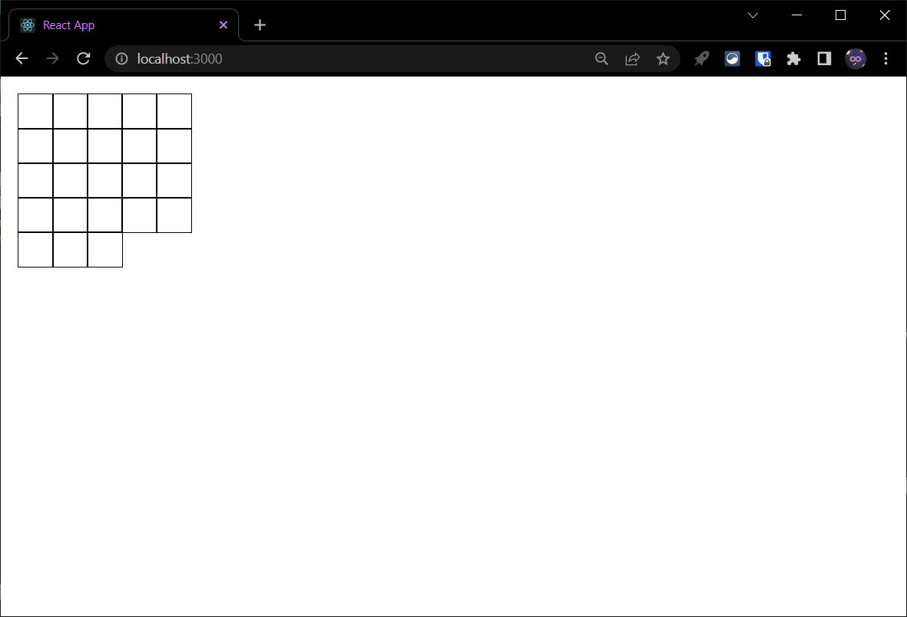
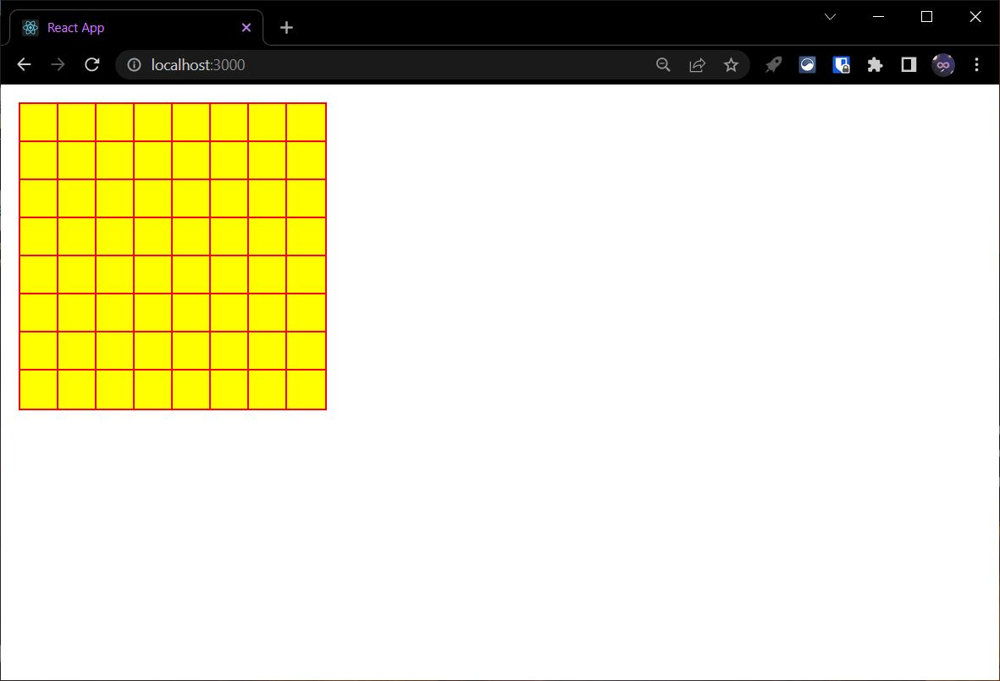
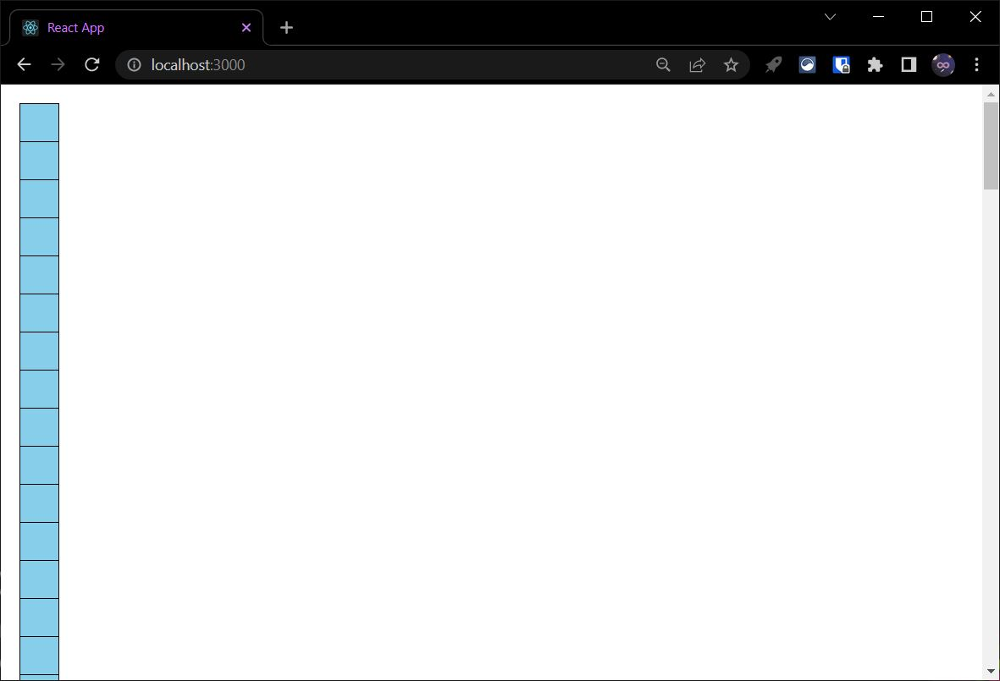

# Grid Pattern in React

## Sample Image:
<center></center>
<br>

## How To Include:
### Step 1: Create BoxGrid.js and copy below code.

### BoxGrid.js

```javascript
import React from "react";

const GridBox = (props) => { 
  let temp = "";
  for(let i = 0; i < props.BoxesInARow; i++){
    temp = temp + "auto ";
  }

  document.getElementById("GridContainer").style.gridTemplateColumns = temp;
  
  const list = []
  for (let i = 0; i < props.NoOfBoxes; i++) {
    list.push(
      <div class="GridContainerBox" 
      style={{
        width: props.BoxWidth,
        height: props.BoxHeight,
        outline: props.BoxOutline,
        background: props.BoxBackground
      }} />
    )
  }

  return (
    <>
    <div 
      className="GridContainer" 
      id="GridContainer" 
      style={{
        display: "grid", 
        gridGap: "0px", 
        width: "fit-content"
      }}
    >
      {list}
    </div>
    </>
  )
};

export default GridBox;
```


### Step 2: Import BoxGrid

```javascript
import "./App.css";
import BoxGrid from "./BoxGrid";

function App() {
  return (
    <div className="App">
      <BoxGrid
        BoxesInARow="10" // Total No. Of Boxes in a Row
        NoOfBoxes="100"  // Total Boxes Your Grid
        BoxWidth="40px"  // Width of a Box
        BoxHeight="40px"  // Height of a Box
        BoxOutline="1px solid black" // Outline of a Box
        BoxBackground= "skyblue" // Background Style of a Box
      />
    </div>
  );
}

export default App;
```

## Examples:
### Example 1:
```html
<BoxGrid
    BoxesInARow="5"
    NoOfBoxes="23"
    BoxWidth="40px" 
    BoxHeight="40px" 
    BoxOutline="2px solid Black"
/>
```


<br>

### Example 2:
```html
<BoxGrid
    BoxesInARow="8"
    NoOfBoxes="64"
    BoxWidth="40px" 
    BoxHeight="40px" 
    BoxOutline="2px solid red"
    BoxBackground= "yellow"
/>
```


<br>

## Note:
You may face this issue that grid is not displaying. In that case follow the following steps:
- Step 1: Comment out Line No. 9 in BoxGrid.js and save and compile the app
  ```javascript
  // document.getElementById("GridContainer").style.gridTemplateColumns = temp;
  ```
  
  Above step will display boxes in a stack

  

  <br>

- Step 2: Undo the comment from Line which was previously commented and again save and compile the app.
  ```javascript
  document.getElementById("GridContainer").style.gridTemplateColumns = temp;
  ```

## [Go Back To Main Page](../README.md)
